# Angular

Angular est un framework JavaScript qui nous aide à creer des sites Web interactifs.

Angular utilise la syntaxe TypeScript qui suis les normes es7+, ainsi que HTML et CSS.

Nous recupererons des styles sur https://getbootstrap.com/ et pour les icones utiliserons la librairie awesome https://fontawesome.com

## Part 1: Introduction
### Version

**AngularJS** inclus toutes les versions Angular 1.x.

**Angular** inclus toutes les versions Angular 2+.

### Architecture

- One way Data Flow: Flux de donnees aé sens unique

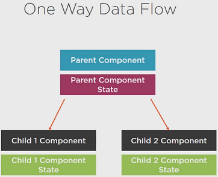

- Dependency Injection: Injection de dependance

	export class AddNewTagComponent {
		constructeur(private articleSvc: ArticleService) {}
	}
	
- Components: Composants

Custom Components:

	@Component({
		selector: 'add-naw-tag',
	}
	export class addNewTagComponent {
	}
	
Custom Components - HTML

	

		<h1>Hello</h1>
		<add-new-tag></add-new-tag>
	
	

- Directives: Directives

Directives - HTML

	

		Hover over me to see
	

	

		Some content
	

- Templates: Modèles

Templates in Components
	
	@Component({
	selector: 'app-about'
	templateUrl: './about.component.html'
	})
	export class AboutComponent {
	}

Templates in-line Components

	@Component({
	selector: 'app-about'
	template: '

		<h1>Title</h1>
	
'
	})
	export class AboutComponent {
	}

- Zone.js et changement de detection

Zone.js permet d'avoir des operations qui s'execute de facon asynchrone, lors d'une interaction utilisateur, lors d'une requete http, suite é un timers ...

- Rendering Targets: Rendu des elements

Le rendu est diffusé sur tous les navigateur et visible sur:

* Browser/DOM
* Server-Side
* Native Mobile Apps  
* Native Desktop Apps
* Other  

### Test tool

Angular contient des outils de test telques:

* TestBed
* Async & fakeAsync
* MockBackend

### Module API

	@NgModule({
		declarations: [ AppComponent, HomeComponent ],
		imports: [ BrowserModule ],
		providers: [ Auth ],
		bootstrap: [ AppComponent ]
	})

## Part 2: Quick starter

Telecharger le projet d'étude à l'adresse url:

https://github.com/DeborahK/Angular-GettingStarted

Installation préalable de:

- npm : Gestionnaire de package de Node.
- Angular, Angular CLI, TypeScript et testing tools, linters, etc...

Les dependances declarees avec leur version sont dans le fichier **package.json**.

Une fois le projet recupere ouvrir un terminal, allez à la racine du projet puis faire.

	npm install
	npm install bootstrap
	npm install font-awesome

Tapper enfin la ligne de commande suivante pour compiler et executer le programme dans votre navigateur.

	npm start

### Modifier le texte d'accueil

Il faut modifier le fichier src/app/app.component.html.
La page du navigateur se met à jour automatiquement.

### Stoper la compilation

Faire Ctrl+C dans le terminal

## Modules

Exemple du modules ES 2015.

Export Module dans product.ts:

	export class Product{
	}

Import Module dans product-list.ts

	import { Product } from './product'

## Component

Il est composé d'un template (View), class (Class) et de metadata (Annotation).

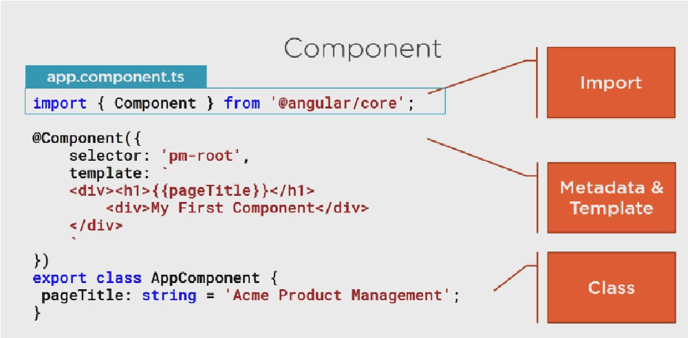

## Metadata

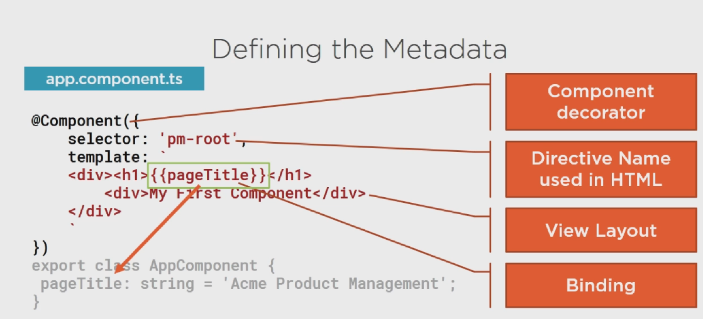

## Creation Component/ Templates, interpolation et directive

Exemple: Creation d'un component gérant une liste de produit.

### Création component

Nous allons ajouter le component "pm-products" product-list.component.

1 - Création folder "products"

2 - Céation du component "product-list.component.ts":

	import { Component } from '@angular/core';
	@Component({
		selector: 'pm-products',
		templateUrl: './product-list.component.html'
		})
	export class ProductListComponent  {
		pageTitle: string = 'Product List';
	}

3 - Importer dans le fichier .css les librairie bootstrap et font-awesome:

	@import "~boostrap/dist/css/bootstrap.min.css";
	@import "~font-awesome/css/font-awesome.min.css";

### Création templet

Dans le fichier html "product-list.component.html".

* Ajout du style **Card** bootstrap [card](https://getbootstrap.com/docs/4.5/components/card/)
* Ajout du systeme **Grid** bootstrap [grid](https://getbootstrap.com/docs/4.5/layout/grid/#offset-classes)
* Ajout du system **Table responsive** bootstrap [table-responsive](https://getbootstrap.com/docs/4.5/content/tables/#breakpoint-specific/)
* Ajout d'un **Tableau** bootstrap [table](https://getbootstrap.com/docs/4.5/content/tables/)
* Ajout d'un **Bouton** bootstrap [btn](https://getbootstrap.com/docs/4.5/components/buttons/#button-tags/)

### Creation directive

1 - Utiliser le component pour y injecter la directive pm-products, dans app.commponent.ts.

	@Component({
		selector: 'pm-root',
		template: `
		...
			<pm-products></pm-products>
		

		`
	})

2 - Ajouter le component au module concerné app.module.ts

	...
	import { ProductListComponent } from './products/product-list.component';
	...
	@NgModule({
	declarations: [
		...
		ProductListComponent
	],
	...
	})

### Binding avec interpolation

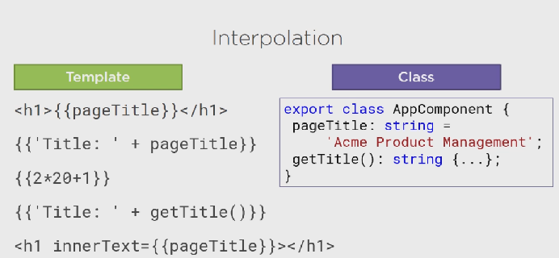

Exemple de directive dans le fichier Html:

	<directive></directive>

Correspondant à la directive du component:

	@Component({
		selector: 'directive',
		...
	})

Exemple de directive integre:

	*ngIf
	*ngFor
	*ngSwitchCase
	*mgModel ...

*Remarque: * signifie que c'est une directive structure

Exemple de directive integre ***ngIf** dans le fichier Html

	<table class="table" *ngIf="products && products.length">
           
Cette directive signifie que si products et products.length retourne vrai alors on affiche la list (Produit, Code, Disponibilité ...) dans le cas contraire elle ne sera pas affichée.

Nous avons donc hardcode une list de produit, celle-ci serait exposé à travers une api coté back.

Dans le fichier product-list.component.ts

	...
	export class ProductListComponent {
		...
		products: any[] = [
			{
				"productId": 2,
				"productName": "Garden Cart",
				"productCode": "GDN-0023",
				"releaseDate": "March 18, 2019",
				"description": "15 gallon capacity rolling garden cart",
				"price": 32.99,
				"starRating": 4.2,
				"imageUrl": "assets/images/garden_cart.png"
			}
			...
		];
	}

Exemple de directive integre ***ngFor** dans le fichier Html

	<tr *ngFor='let product of products'>
		<td></td>
		<td>{{ product.productName }}</td>
		<td>{{ product.productCode }}</td>
		<td>{{ product.releaseDate }}</td>
		<td>{{ product.price }}</td>
		<td>{{ product.starRating }}</td>
	</tr>
           
Cette directive permet d'afficher pour chaque produit de produits : productName, productCode, releaseDate, price, starRating.

Rappel **for...of vs for...in**

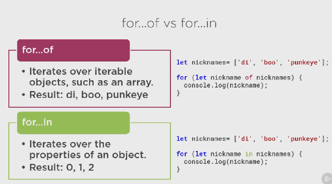

## Data binding et pipes

### Property binding

	

Dans cet exemple le binding se fait à l'aide des [] suivi de la source mais peut etre fait avec une expression entre {{}} ou par interpolation.

		
		

		

### Event binding

Ressource utile repectoriant tous les events possible: 
https://developer.mozilla.org/en-US/docs/web/events

	<button (click)="toggleImage()">

click est le target event et toggleImage le template Statement.

1 - Ecrir la methode toggleImage dans product-list.component.ts

	toggleImage(): void {
		this.showImage = !this.showImage;
	};

2 - Mettre en place l'event sur le bouton dans product-list.component.html

	<button class="btn btn-primary" (click)="toggleImage()">
		Montrer image
	</button>

3 - Puis onajoute la logic qui affichera ou pas la list suivant l'etat du bouton dans product-list.component.html.

	<tr *ngFor='let product of products'>
		<td>
			
		</td>
	...

4 - Nous allons enfin binding le text du bouton afin qu'il change suivant l'evenement click.

	<button class="btn btn-primary"
		(click)="toggleImage()">
			{{ showImage ? "Cacher":"Montrer" }} image
	</button>

### Liaison bidirectionnelle

Exemple sur le filtre.

Nous utiliserons la directive ngModel [(ngModel)].

1 - Ajouter la propriete dans product-list.component.ts

	listFilter: string = "cart"

2 - Ajouter la directive ngModel dans product-list.component.html.

  [(ngModel)]="listFilter"

3 - Puis utiliser l'interpolation pour changer le textr saisi

	<h4>Filtré par : {{listFilter}}</h4>

4 - Nous devons enfin import le FormModule dans app.module.ts

	...
	import { FormsModule } from '@Angular/forms';
	...
	@NgModule({
	...
		imports: [
		...
			FormsModule
		],
	...

### Transforme datas avec des pipes

Exemple de specification lowercase:

	{{product.productCode | lowercase }}

1 - Nous voulons par exemple que le nom du produit commence par une majuscule alors dans product-list.component.html.

	

Ou s'il on veux le prix en minuscule

	{{ product.price | currency | lowercase }}

Et en $, avec comme parametres 'USD', symbol et digit info (minimum digit) :

	{{ product.price | currency: 'USD':'symbol':'1.2-2' | lowercase }}

1.2 signifie 1 digit à gauche, 2 deux digit a gauche et limité à 2 digit à gauche

	...
	<td>{{ product.productCode | lowercase }}</td>
	<td>{{ product.price | currency:'EUR':'symbol':'1.2-2' }}</td>
	...

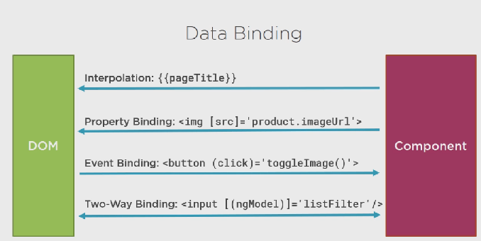

## Interface

1 - Exemple creer un fichier product.ts dans lequel nous ecrirons notre interface :

	export interface IProduct {
		productId: number;
		productName: string;
		productCode: string;
		releaseDate: Date;
		price: number;
		description: string;
		startRating: number;
		imageUrl: string;
		calculateDiscount(percent: number): number;
	}

2 - Puis nous remplacerons le type any du parametre products par l'interface dans product-list.component.ts

	...
	import { IProduct } from './product';
	...
	product: IProduct[]
	...

Le typage fort permet de lever les eventelles erreur de syntaxe car ils doivent parfaitement match avec l'interface.

3 - Nous allons maintenant creer la class implementant l'interface dans product.ts avec son constructeur.

## Encapsulation du style Css au component

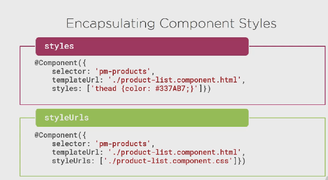

1 - On creer le fichier css associé au component products

	thead{
		color: #337AB7
	}

2 - Puis nous ajoutons le style à notre component. Nous pouvons ici y ajouter autant de feuilles de style que l'on souhaite:

	@Component({
		...
		styleUrls:['./product-list.component.css']
	})

## Cycle de vie d'un component

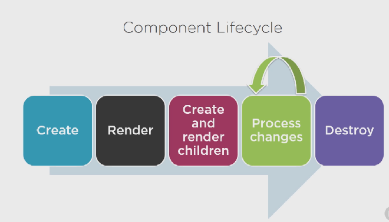

OnInit: Effectue l'initialisation du component, avec la récupération des datas.

Onchanges: Effectue une action apres modification des proprietes d'entree.

OnDestry: Effectue le nettoyage

1 - nous appelons l'interface dans le component
	...
	import { Component, OnInit } from '@angular/core';
	...
	export class ProductListComponent implements OnInit {
		...
	ngOnInit(): void {
		console.log('Initialisation component list produit');
	};
		...
	}

Nous verrons s'afficher le message d'initialisation dans la console.log

## Transformation des datas avec des custom pipes

Nous allons remplacer les tirets (-) des codes produits par des espaces.

1 - Dans le dossier shared creer un fichier convert-to-spaces.pipe.ts

	import { Pipe, PipeTransform } from '@angular/core';
	@Pipe({
		name: 'convertToSpaces'
	})
	export class ConvertToSpacesPipe implements PipeTransform {
		transform(value: string, character: string): string {
			return value.replace(character, ' ');
		}
	}

2 - Utilisation du pipe dans product-list.component.html

	<td>{{ product.productCode | lowercase | convertToSpaces: '-' }}</td>

3 - Ajouter le custom pipe dans le app.module.ts

	...
	import { ConvertToSpacesPipe } from './shared/convert-to-spaces.pipe';
	@NgModule({
		declarations: [
		...
		ConvertToSpacesPipe
		],
	...

**Une recompilation est à faire lors que l'on effectue un changement dans app.module.ts**

## Getter

## Setter

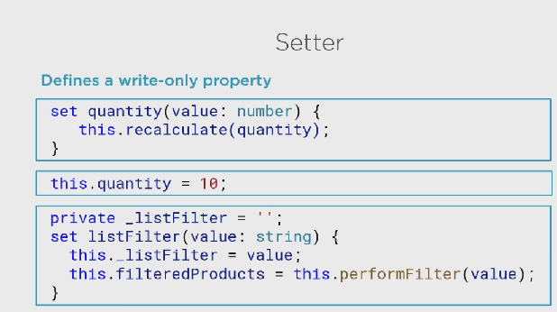

## getter/ setter

 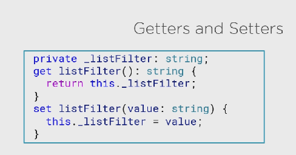

## Filtrer une list

1 - Declarer la propriété suivante dans product-list.component.ts:

	filteredProducts: IProduct[];

2 - Generer getter & setter de listFilter

	private _listFilter: string;
	public get listFilter(): string {
		return this._listFilter;
	}
	public set listFilter(value: string) {
		this._listFilter = value;
	}

3 - Puis on ajoute à la methode set listFilter la nouvelle attribution de valuer a filteredProducts sur condition que listFilter soit renseigné.

	this.filteredProducts = this.listFilter ? this.performFilter(this.listFilter) : this.products;

4 - On creer la methodeperformFilter()

	performFilter(filterBy: string): IProduct[] {
		// filterBy est insensitive à la casse (toLocaleLowerCase())
		filterBy = filterBy.toLocaleLowerCase();
		return this.products.filter((product: IProduct) => product.productName.toLocaleLowerCase().indexOf(filterBy) !== -1);
	}

Plus d'information: https://developer.mozilla.org/en-US/docs/Web/JavaScript/Reference/Global_Objects/Array/filter

5 - on creer un constructeur pour initialiser le filtre:

	constructor(){
		this.filteredProducts = this.products;
		this.listFilter = 'cart'
	}

6 - On change dans le templet la directive *ngFor pour y bind le filtre

	<tr *ngFor='let product of filteredProducts'>

## Construction d'un component imbriqué (poupé russe) Nested Component

Exemple sur la colonne Evaluation nous y ajouterons un component de selection representé par des etoiles.

### Construction component imbriqué
 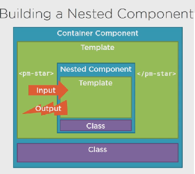

1 - Creation star.component.ts avec ces fichiers html et css associés

* star.component.html

	

	

		
		
		
		
		
	

	

* star.component.css

	.crop {
	overflow: hidden;
	}
	div {
	cursor: pointer;
	}

* star.component.ts

Rappel:

 1. Creation @Component + import
 2. A l'interieur de @Component:
	* selector
	* templateUrl
	* styleUrls
 3. Declaration de la classe

	export class NameComponent {
		attribut
		methode
		...
	}

 4. et (ou) implement un event (ex: onchange) sur la class + implementation interface

	export class NameComponent implements OnChanges {
		attribut;
		// retour attendu de la methode sans parametre
		ngOnChange():void{}
	}

Exemple:

	import { Component, OnChanges } from '@angular/core';
	@Component({
		selector: 'pm-star',
		templateUrl: './star.component.html',
		styleUrls: ['./star.component.css']
	})
	export class StarComponent implements OnChanges {
		//Propriets, qui seront bind sur le html à l'aide des []
		rating: number = 4;
		starWidth: number = 4;
		ngOnChanges(): void {
			this.starWidth = this.rating * 75 / 5;
		}
	}

5. Toujours finir par renseigner le app.module

	@NgModule({
  	declarations: [
    ...
    StarComponent
  ],
  ...
  
### Utilisation du component imbriqué

- On remplace {{ product.ranking }} par la directive pm-star est l'atttribut bind [rating]='product.starRating'

	<td><pm-start [rating]='product.starRating'></pm-start></td>

### Passer des datas au component imbriqué en utilisant @Input

Nous devons juste ajouter la decoration @Input() devant l'attribut que l'on desire mettre dans le composant imbriqué

### Passer des datas au component imbriqué en utilisant @Output
Nous desirons que l'evaluation soit retourné dans le titre de la page

 1. On ajoute l'event dans le fichier html

	

 2. On cree la methode onClick avec un console.log par exemple

	onClick():void{
        console.log("L'evaluation de ${this.rating} est selectionné")
    }

 3. Ajouter la decoration @Output() devant l'attribut que l'on souhaite surveiller, attribut membre à la classe EventEmitter, afin qu'il nous retourne son changement d'état.

 	@Output() ratingClicked: EventEmitter<string> = new EventEmitter<string>();

 4. On utilise cet attribut en utilisant la methode emit d'EventEmitter

	this.ratingClicked.emit(`L'evaluation de ${this.rating} est selectionné`)

 5. Nous pouvons desormais indiquer notre attribut dans product-list.component.html en lui donnant la valeur retourné par la methode onRatingClicked($event)

	<td><pm-star [rating]='product.starRating' 
                 (ratingClicked)='onRatingClicked($event)'>
		</pm-star></td>

 6. On cree la methode onRatingClicked($event) dans product-list.component.ts, ce

## Injection de services et de depenences

### Construction de service (utile pour logging initialiser des datas...)
Un service doit etre independant et autonome.
Par exemple service de logging.

Exemple de service de data de produit 

 1. Create la classe service
 2. definir les metadata avec les decorations
 3. Importer se dont on a besoin

- Creer nouveau file product.service.ts dans le dossier product

	import { Injectable } from '@angular/core';
	import { IProduct } from './product'

	@Injectable()
	export class ProductService {
		getProducts(): IProduct[] {
			return [
				{
					"productId": 2,
					"productName": "Garden Cart",
					"productCode": "GDN-0023",
					"releaseDate": "March 18, 2019",
					"description": "15 gallon capacity rolling garden cart",
					"price": 32.99,
					"starRating": 4.2,
					"imageUrl": "assets/images/garden_cart.png"
				}
			];
		}
	}

- Enregistrer votre service

	@Injectable({
		providedIn: 'root'
	})

- Puis utiliser le service en l'injectant dans le constructeur dans product-list.component.ts.

	constructor(private productService: ProductService){
		this.filteredProducts = this.products;
		this.listFilter = 'cart'
	}

Puis en l'initialisant dans

	ngOnInit(): void {
		this.products = this.productService.getProducts();
		console.log('Initialisation component list produit');
	};

## Récupération de données à l'aide de Http

	 
	
    