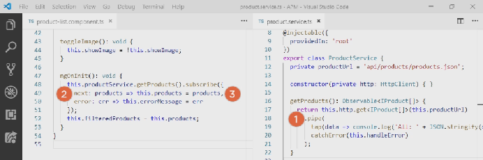

# Angular

Angular est un framework JavaScript qui nous aide à creer des sites Web interactifs.

Angular utilise la syntaxe TypeScript qui suis les normes es7+, ainsi que HTML et CSS.

Nous recupererons des styles sur https://getbootstrap.com/ et pour les icones utiliserons la librairie awesome https://fontawesome.com


<!-- TOC -->

- [Angular](#angular)
    - [Part 1: Introduction](#part-1-introduction)
        - [Version](#version)
        - [Architecture](#architecture)
        - [Test tool](#test-tool)
        - [Module API](#module-api)
    - [Part 2: Quick starter](#part-2-quick-starter)
        - [Modifier le texte d'accueil](#modifier-le-texte-daccueil)
        - [Stoper la compilation](#stoper-la-compilation)
    - [Export/ Import de classe](#export-import-de-classe)
    - [Component](#component)
    - [Metadata](#metadata)
    - [Creation Component/ Templates, interpolation et directive](#creation-component-templates-interpolation-et-directive)
        - [Création component](#création-component)
        - [Création templet](#création-templet)
        - [Creation directive](#creation-directive)
        - [Binding avec interpolation](#binding-avec-interpolation)
    - [Data binding et pipes](#data-binding-et-pipes)
        - [Property binding](#property-binding)
        - [Event binding](#event-binding)
        - [Liaison bidirectionnelle](#liaison-bidirectionnelle)
        - [Transformer les datas avec des pipes](#transformer-les-datas-avec-des-pipes)
    - [Interface](#interface)
    - [Encapsulation du style Css au component](#encapsulation-du-style-css-au-component)
    - [Cycle de vie d'un component](#cycle-de-vie-dun-component)
    - [Transformation des datas avec des custom pipes](#transformation-des-datas-avec-des-custom-pipes)
    - [Getter](#getter)
    - [Setter](#setter)
    - [getter/ setter simple sans traitement particulier](#getter-setter-simple-sans-traitement-particulier)
    - [Filtrer une list](#filtrer-une-list)
    - [Construction d'un component imbriqué (poupé russe) Nested Component](#construction-dun-component-imbriqué-poupé-russe-nested-component)
        - [Construction component imbriqué](#construction-component-imbriqué)
        - [Utilisation du component imbriqué](#utilisation-du-component-imbriqué)
        - [Passer des datas au component imbriqué en utilisant @Input](#passer-des-datas-au-component-imbriqué-en-utilisant-input)
        - [Passer des datas au component imbriqué en utilisant @Output (emit)](#passer-des-datas-au-component-imbriqué-en-utilisant-output-emit)
    - [Injection de services et de dependences](#injection-de-services-et-de-dependences)
        - [Construction de service (utile pour logging initialiser des datas)](#construction-de-service-utile-pour-logging-initialiser-des-datas)
    - [Récupération de données à l'aide de Http](#récupération-de-données-à-laide-de-http)
        - [Extensions observable et reactive](#extensions-observable-et-reactive)
        - [Envoi de requete Http](#envoi-de-requete-http)
        - [Sousciption à un observable](#sousciption-à-un-observable)
    - [Notions de navigation et de routage](#notions-de-navigation-et-de-routage)
        - [Creation du component product-detail](#creation-du-component-product-detail)
        - [Creation du component welcome](#creation-du-component-welcome)
    - [Routing](#routing)
    - [Navigation entre les differentes routes](#navigation-entre-les-differentes-routes)
    - [Technique additionnelle de navigation et routage](#technique-additionnelle-de-navigation-et-routage)
        - [Passer des paramétres au route](#passer-des-paramétres-au-route)
        - [Activer des route avec du code](#activer-des-route-avec-du-code)
        - [Proteger les routes avec des guards](#proteger-les-routes-avec-des-guards)
        - [Angular Module](#angular-module)
- [Linux](#linux)

<!-- /TOC -->

## Part 1: Introduction
### Version

**AngularJS** inclus toutes les versions Angular 1.x.

**Angular** inclus toutes les versions Angular 2+.

### Architecture

- One way Data Flow: Flux de donnees aé sens unique


- Dependency Injection: Injection de dependance

```js
export class AddNewTagComponent {
	constructeur(private articleSvc: ArticleService) {}
}
```

- Components: Composants

Custom Components:

```js
@Component({
	selector: 'add-naw-tag',
}
export class addNewTagComponent {
}
```

Custom Components - HTML

```html
<div>
	<h1>Hello</h1>
	<add-new-tag></add-new-tag>
</div>
```

- Directives: Directives

Directives - HTML

```html
<div hover-trigger>
	Hover over me to see
</div>
<div appear-on-hover>
	Some content
</div>
```

- Templates: Modèles

Templates in Components
	
```js
@Component({
	selector: 'app-about'
	templateUrl: './about.component.html'
})
export class AboutComponent {
}
```

Templates in-line Components

```js
@Component({
	selector: 'app-about'
	template: '<div>
		<h1>Title</h1>
	</div>'
})
export class AboutComponent {
}
```

- Zone.js et changement de detection

Zone.js permet d'avoir des operations qui s'execute de facon asynchrone, lors d'une interaction utilisateur, lors d'une requete http, suite à un timers 

- Rendering Targets: Rendu des elements

Le rendu est diffusé sur tous les navigateur et visible sur:

* Browser/DOM
* Server-Side
* Native Mobile Apps  
* Native Desktop Apps
* Other  

### Test tool

Angular contient des outils de test telques:

* TestBed
* Async & fakeAsync
* MockBackend

### Module API
```js
	@NgModule({
		declarations: [ AppComponent, HomeComponent ],
		imports: [ BrowserModule ],
		providers: [ Auth ],
		bootstrap: [ AppComponent ]
	})
```
## Part 2: Quick starter

Telecharger le projet d'étude à l'adresse url:

https://github.com/DeborahK/Angular-GettingStarted

Installation préalable de:

- npm : Gestionnaire de package de Node.
- Angular, Angular CLI, TypeScript et testing tools, linters, etc

Les dependances declarees avec leur version sont dans le fichier **package.json**.

Verifier les version de npm et nodejs

	npm -v
	node -v


Une fois le projet recupere ouvrir un terminal, allez à la racine du projet puis faire.

	npm install -g @angular/cli
	ng v
	npm install
	npm install bootstrap
	npm install font-awesome


Tapper enfin la ligne de commande suivante pour compiler et executer le programme dans votre navigateur.

	npm start

### Modifier le texte d'accueil

Il faut modifier le fichier src/app/app.component.html.
La page du navigateur se met à jour automatiquement.

### Stoper la compilation

Faire Ctrl+C dans le terminal

## Export/ Import de classe

Export dans product.ts de la classe Product:
```js
	export class Product{
	}
```
Import Product dans product-list.ts
```js
	import { Product } from './product'
```
## Component

Il est composé d'un template (View), class (Class) et de metadata (Annotation).


## Metadata


## Creation Component/ Templates, interpolation et directive

Exemple: Creation d'un component gérant une liste de produit.

### Création component

Nous allons ajouter le component "pm-products" dans le fichier product-list.component.

1 - Création folder "products"

2 - Céation du component "product-list.component.ts":
```js
	import { Component } from '@angular/core';
	@Component({
		selector: 'pm-products',
		templateUrl: './product-list.component.html'
		})
	export class ProductListComponent  {
		pageTitle: string = 'Product List';
	}
```
3 - Importer dans le fichier styles.css les librairie bootstrap et font-awesome:
```js
	@import "~boostrap/dist/css/bootstrap.min.css";
	@import "~font-awesome/css/font-awesome.min.css";
```
### Création templet

Dans le fichier html "product-list.component.html".

* Ajout du style **Card** bootstrap [card](https://getbootstrap.com/docs/4.5/components/card/)
* Ajout du systeme **Grid** bootstrap [grid](https://getbootstrap.com/docs/4.5/layout/grid/#offset-classes)
* Ajout du system **Table responsive** bootstrap [table-responsive](https://getbootstrap.com/docs/4.5/content/tables/#breakpoint-specific/)
* Ajout d'un **Tableau** bootstrap [table](https://getbootstrap.com/docs/4.5/content/tables/)
* Ajout d'un **Bouton** bootstrap [btn](https://getbootstrap.com/docs/4.5/components/buttons/#button-tags/)

### Creation directive

1 - Utiliser le component pour y injecter la directive pm-products, dans app.component.ts.
```js
	@Component({
		selector: 'pm-root',
		template: `
			<pm-products></pm-products>
		</div>
		`
	})
```
Oubien indiquer dans TempletUrl: 'chemin d'acces au fichier html'.
Puis dans le fichier html injecter la directive.

Dans le fichier app.component.ts
```js
	templateUrl:'app.component.html',
```
Dans le fichier app.component.HTML
```html
	<pm-products></pm-products>
```
2 - Ajouter le component dans le module concerné app.module.ts
```js
	import { ProductListComponent } from './products/product-list.component';
	@NgModule({
		declarations: [
			ProductListComponent
		],
	})
```
### Binding avec interpolation


Exemple de directive dans le fichier Html:
```html
	<directive></directive>
```
Correspondant à la directive du component:
```js
	@Component({
		selector: 'directive',
	})
```
Exemple de directive integre:

	*ngIf
	*ngFor
	*ngSwitchCase
	*mgModel 

*Remarque:* l'asterisque signifie que c'est une directive structurel d'Angular.

Exemple de directive integre ***ngIf** dans le fichier Html
```html
	<table class="table" *ngIf="products && products.length">
```           
Cette directive signifie que si products et products.length retourne vrai alors on affiche la list (Produit, Code, Disponibilité ) dans le cas contraire elle ne sera pas affichée.

Nous avons donc hardcode une list de produit, celle-ci serait exposé à travers une api coté back.

Dans le fichier product-list.component.ts
```js
	export class ProductListComponent {
		products: any[] = [
			{
				"productId": 2,
				"productName": "Garden Cart",
				"productCode": "GDN-0023",
				"releaseDate": "March 18, 2019",
				"description": "15 gallon capacity rolling garden cart",
				"price": 32.99,
				"starRating": 4.2,
				"imageUrl": "assets/images/garden_cart.png"
			}
		];
	}
```
Exemple de directive integre ***ngFor** dans le fichier Html
```html
	<tr *ngFor='let product of products'>
		<td></td>
		<td>{{ product.productName }}</td>
		<td>{{ product.productCode }}</td>
		<td>{{ product.releaseDate }}</td>
		<td>{{ product.price }}</td>
		<td>{{ product.starRating }}</td>
	</tr>
```        
Cette directive permet d'afficher pour chaque produit de produits : productName, productCode, releaseDate, price, starRating.

Rappel **forof vs forin**


## Data binding et pipes

### Property binding
```html
	
```
Dans cet exemple le binding se fait à l'aide des [] suivi de la source mais peut etre fait avec une expression entre {{}} ou par interpolation.
```html


```
### Event binding

Ressource utile repectoriant tous les events possible: 
https://developer.mozilla.org/en-US/docs/web/events
```html
	<button (click)="toggleImage()">
```
click est le target event et toggleImage le template Statement.

1 - Ecrir la methode toggleImage dans product-list.component.ts
```js
	toggleImage(): void {
		this.showImage = !this.showImage;
	};
```
2 - Mettre en place l'event sur le bouton dans product-list.component.html
```html
	<button class="btn btn-primary" (click)="toggleImage()">
		Montrer image
	</button>
```
3 - Puis on ajoute la logic qui affichera ou pas la list suivant l'etat du bouton dans product-list.component.html à l'aide de *ngIf.
```html
	<tr *ngFor='let product of products'>
		<td>
			
		</td>
	
```
4 - Nous allons enfin binding le text du bouton afin qu'il change suivant l'evenement click.
```html
	<button class="btn btn-primary"
		(click)="toggleImage()">
			{{ showImage ? "Cacher":"Montrer" }} image
	</button>
```
### Liaison bidirectionnelle

Exemple sur le filtre.

Nous utiliserons la directive ngModel [(ngModel)].

1 - Ajouter la propriete dans product-list.component.ts
```js
	listFilter: string = "cart"
```
2 - Ajouter la directive ngModel dans product-list.component.html.

```html
 <input type='text' [(ngModel)]='listFilter'/>
```

3 - Puis utiliser l'interpolation pour changer le texte saisi
```html
	<h4>Filtré par : {{listFilter}}</h4>
```
4 - Nous devons enfin import le FormModule dans app.module.ts
```js
	import { FormsModule } from '@angular/forms';
	@NgModule({
		imports: [
			FormsModule
		],
```
### Transformer les datas avec des pipes

Exemple de specification lowercase:
```html
	 <td>{{ product.productCode | lowercase }}</td>
```
1 - Nous voulons par exemple que le nom du produit commence par une majuscule alors dans product-list.component.html.
```html
	
```
Ou s'il on veux le prix en minuscule
```html
	<td>{{ product.price | currency | lowercase }}</td>
```
Et en $, avec comme parametres 'USD', symbol et digit info (minimum digit) :
```html
	<td>{{ product.price | currency: 'USD':'symbol':'1.2-2' | lowercase }}</td>
```
1.2 signifie 1 digit à gauche, 2 deux digit a gauche et limité à 2 digit à gauche
```html
	<td>{{ product.productCode | lowercase }}</td>
	<td>{{ product.price | currency:'EUR':'symbol':'1.2-2' }}</td>
```


## Interface

1 - Exemple creer un fichier product.ts dans lequel nous ecrirons notre interface :
```js
	export interface IProduct {
		productId: number;
		productName: string;
		productCode: string;
		releaseDate: Date;
		price: number;
		description: string;
		startRating: number;
		imageUrl: string;
		calculateDiscount(percent: number): number;
	}
```
2 - Puis nous remplacerons le type any du parametre products par l'interface dans product-list.component.ts
```js
	import { IProduct } from './product';
	product: IProduct[]
```
Le typage fort permet de lever les eventelles erreurs de syntaxes car les attributs membre de la classe doivent parfaitement match avec ceux de l'interface.

3 - Nous allons maintenant creer la class implementant l'interface dans product.ts avec son constructeur.
```js
	export class Product implements IProduct {
		constructor(public productId: number,
		public productName: string,
		public productCode: string,
		public productDate: string,
		public price: string,
		public description: string,
		public starRating: string,
		public imageUrl: string){
		}
		calculateDiscount(percent: number): number{
			return this.price - (this.price * percent / 100);
		}
	}
```
## Encapsulation du style Css au component


1 - On creer le fichier css associé au component products
```css
	thead{
		color: #337AB7
	}
```
2 - Puis nous ajoutons le style à notre component. Nous pouvons ici y ajouter autant de feuilles de style que l'on souhaite:
```js
	@Component({
		styleUrls:['./product-list.component.css']
	})
```
## Cycle de vie d'un component


OnInit: Effectue l'initialisation du component, avec la récupération des datas, par exemple.

Onchanges: Effectue une action apres modification des proprietes d'entree lors d'un click bouton, par exemple.

OnDestry: Effectue le nettoyage

1 - Par exemple, nous pouvons utiliser l'implementation OnInit dans la classe ProductListComponent afin de définir la methode ngOnInit et par la suite initialiser la liste de produit.

	```js
	import { Component, OnInit } from '@angular/core';
	export class ProductListComponent implements OnInit {
		ngOnInit(): void {
			console.log('Initialisation component list produit');
		};
	}
	```

Nous verrons s'afficher le message d'initialisation dans la console.log

## Transformation des datas avec des custom pipes

Nous allons remplacer les tirets (-) des codes produits par des espaces.

1 - Dans le dossier shared creer un fichier convert-to-spaces.pipe.ts
```js
	import { Pipe, PipeTransform } from '@angular/core';
	@Pipe({
		name: 'convertToSpaces'
	})
	export class ConvertToSpacesPipe implements PipeTransform {
		transform(value: string, character: string): string {
			return value.replace(character, ' ');
		}
	}
```
2 - Utilisation du pipe dans product-list.component.html
```html
	<td>{{ product.productCode | lowercase | convertToSpaces: '-' }}</td>
```
3 - Ajouter le custom pipe dans le app.module.ts
```js
	import { ConvertToSpacesPipe } from './shared/convert-to-spaces.pipe';
	@NgModule({
		declarations: [
		ConvertToSpacesPipe
		],
```
**ATTENTION : Une recompilation est à faire lorsque l'on effectue un changement dans app.module.ts**

## Getter


## Setter


## getter/ setter simple sans traitement particulier

 

## Filtrer une list

1 - Declarer un attribut de type interface, ici IPrudct[] dans product-list.component.ts:
```js
	filteredProducts: IProduct[];
```
2 - Generer getter & setter de listFilter à l'aide de l'IDE
```js
	private _listFilter: string;
	public get listFilter(): string {
		return this._listFilter;
	}
	public set listFilter(value: string) {
		this._listFilter = value;
	}
```
3 - Puis on ajoute à la methode set listFilter la nouvelle attribution de valeur a filteredProducts sur condition que listFilter soit renseigné filtré, dans ce cas on appel la methode performFilter sinon on retourne toute mla liste non filtrée.
```js
	this.filteredProducts = this.listFilter ? this.performFilter(this.listFilter) : this.products;
```
4 - On creer la methode performFilter() retournant la nouvelle liste de produits filtrée.
```js
	performFilter(filterBy: string): IProduct[] {
		// filterBy est insensitive à la casse (toLocaleLowerCase())
		filterBy = filterBy.toLocaleLowerCase();
		return this.products.filter((product: IProduct) => product.productName.toLocaleLowerCase().indexOf(filterBy) !== -1);
	}
```
Plus d'information: https://developer.mozilla.org/en-US/docs/Web/JavaScript/Reference/Global_Objects/Array/filter

5 - on creer un constructeur pour initialiser le filtre:
```js
	constructor(){
		this.filteredProducts = this.products;
		this.listFilter = 'cart'
	}
```
6 - On change dans le templet la directive *ngFor pour y bind le filtre
```html
	<tr *ngFor='let product of filteredProducts'>
```
## Construction d'un component imbriqué (poupé russe) Nested Component

Exemple sur la colonne Evaluation nous y ajouterons un component de selection representé par des etoiles.

### Construction component imbriqué
 

1 - Creation star.component.ts avec ces fichiers html et css associés

* star.component.html

    ```html
	<div class="crop"
		[style.width.px]="starWidth"
		[title]="rating">
	<div style="width: 75px">
		<span class="fa fa-star"></span>
		<span class="fa fa-star"></span>
		<span class="fa fa-star"></span>
		<span class="fa fa-star"></span>
		<span class="fa fa-star"></span>
	</div>
	</div>
	```

* star.component.css
```css
	.crop {
	overflow: hidden;
	}
	div {
	cursor: pointer;
	}
```
* star.component.ts

Rappel:

 1. Creation @Component + import
 2. A l'interieur de @Component:
	* selector
	* templateUrl
	* styleUrls
 3. Declaration de la classe
```js
	export class NameComponent {
		attribut
		methode
	}
```
 4. et (ou) implement un event (ex: onchange) sur la class + implementation interface
```js
	export class NameComponent implements OnChanges {
		attribut;
		// retour attendu de la methode sans parametre
		ngOnChange():void{}
	}
```
Exemple:
```js
	import { Component, OnChanges } from '@angular/core';
	@Component({
		selector: 'pm-star',
		templateUrl: './star.component.html',
		styleUrls: ['./star.component.css']
	})
	export class StarComponent implements OnChanges {
		//Propriets, qui seront bind sur le html à l'aide des []
		rating: number = 4;
		starWidth: number = 4;
		ngOnChanges(): void {
			this.starWidth = this.rating * 75 / 5;
		}
	}
```
5. Toujours finir par renseigner le app.module
```js
@NgModule({
	declarations: [
	StarComponent
	],
})
```
### Utilisation du component imbriqué

- On remplace {{ product.ranking }} par la directive pm-star est l'atttribut bind [rating]='product.starRating'
```html
	<td><pm-start [rating]='product.starRating'></pm-start></td>
```
### Passer des datas au component imbriqué en utilisant @Input

Nous devons juste ajouter la decoration @Input() devant l'attribut que l'on desire mettre dans le composant imbriqué

### Passer des datas au component imbriqué en utilisant @Output (emit)

Nous desirons que l'evaluation soit retourné dans le titre de la page

 1. On ajoute l'event dans le fichier html
```html
	<div class="crop"
     	[style.width.px]="starWidth"
     	[title]="rating"
     	(click)="onClick()">
```
 2. On cree la methode onClick avec un console.log par exemple
```js
	onClick():void{
        console.log("L'evaluation de ${this.rating} est selectionné")
    }
```
 3. Ajouter la decoration @Output() devant l'attribut que l'on souhaite surveiller, attribut membre à la classe EventEmitter, afin qu'il nous retourne son changement d'état.
```js
 	@Output() ratingClicked: EventEmitter<string> = new EventEmitter<string>();
```
 4. On utilise cet attribut en utilisant la methode emit d'EventEmitter
```js
	this.ratingClicked.emit(`L'evaluation de ${this.rating} est selectionné`)
```
 5. Nous pouvons desormais indiquer notre attribut dans product-list.component.html en lui donnant la valeur retourné par la methode onRatingClicked($event)
```html
	<td><pm-star [rating]='product.starRating' 
                 (ratingClicked)='onRatingClicked($event)'>
		</pm-star></td>
```
 6. On cree la methode onRatingClicked($event) dans product-list.component.ts.
```js
	onRatingClicked(message: string): void{
		this.pageTitle ='List de produit '+ message;
	};
```
## Injection de services et de dependences

### Construction de service (utile pour logging initialiser des datas)
Un service doit etre independant et autonome.
Par exemple service de logging.

Exemple de service de data de produit 

 1. Create la classe service
 2. definir les metadata avec les decorations
 3. Importer se dont on a besoin

- Creer nouveau file product.service.ts dans le dossier product
```js
	import { Injectable } from '@angular/core';
	import { IProduct } from './product'
	@Injectable()
	export class ProductService {
		getProducts(): IProduct[] {
			return [
				{
					"productId": 2,
					"productName": "Garden Cart",
					"productCode": "GDN-0023",
					"releaseDate": "March 18, 2019",
					"description": "15 gallon capacity rolling garden cart",
					"price": 32.99,
					"starRating": 4.2,
					"imageUrl": "assets/images/garden_cart.png"
				}
			];
		}
	}
```
- Enregistrer votre service
```js
	@Injectable({
		providedIn: 'root'
	})
```

- Puis utiliser le service en l'injectant dans le constructeur dans product-list.component.ts.
```js
	constructor(private productService: ProductService){
		this.filteredProducts = this.products;
		this.listFilter = 'cart'
	}
```
Puis en l'initialisant dans
```js
	ngOnInit(): void {
		this.products = this.productService.getProducts();
		console.log('Initialisation component list produit');
	};
```
## Récupération de données à l'aide de Http
Reactive Extensions for JavaScript (RxJS): 
Est une bibliothèque de programmation réactive utilisant des observables qui facilite la composition de code asynchrone ou basé sur le rappel.

**Documentation sur RxJS :https://rxmarbles.com/**

### Extensions observable et reactive


Par convention l'observable est noté, par exemple:
```js
	const source$: Observable<number>
```


### Envoi de requete Http

 1. Ajouter la librairy http au fichier app.module.ts
```js
	import { HttpClientModule } from '@angular/common/http';
	@NgModule({
		declarations: [
		],
		imports: [
			HttpClientModule
		],
```
 2. Dans le fichier product.service.ts, creer un constructeur prenant en parametre une instance d'HttpClient() + declarer un attribut pointant sur l'url de l'api (ici l'api est en local).
 
 Nous pouvons utiliser l'api en local car nous avions definie dans le fichier angular.json src/api:
```json
	"projects": {
		"APM": {
			"assets": [
			"src/favicon.ico",
			"src/assets",
			"src/api"
			],
```

Dans le fichier product.service.ts
```js
	constructor(private http: HttpClient){}
	private productUrl = 'api/products/product.json';
```
On peux desormais supprimer les produits hard code pour les remplacer par la list observé telquel:
```js
	import { Observable } from 'rxjs';
	export class ProductService {
		private productUrl = 'api/products/products.json';
		constructor(private http: HttpClient){}
		getProducts(): Observable<IProduct[]> {
			return this.http.get<IProduct[]>(this.productUrl);
		}
	}
```
Pour toutes envoi de requete http, il est nécessaire de mettre en place les Exception Handling pour traiter les requetes qui echoue ou qui sont incorrect:
```js
	private handleError(err:HttpErrorResponse){
		let errorMessage = '';
		if (err.error instanceof ErrorEvent){
			errorMessage = `Une erreur est apparue : ${err.error.message}`;
		} else {
			errorMessage = `Le code retourné par le serveur : ${err.status}, message d'erreur est : ${err.message}`;
		}
		console.error(errorMessage);
		return throwError(errorMessage);
		};
		getProducts(): Observable<IProduct[]> {
			return this.http.get<IProduct[]>(this.productUrl).pipe(
			tap(data => console.log('Tous : ' + JSON.stringify(data))),
			catchError(this.handleError)
		);
	}
```
### Sousciption à un observable

	x.subscribe(Observable)
	x.subscribe({
		nextFn,
		errorFn,
		completeFn
	})


Dans product-list.component.ts. this.products est en erreur.
En effet suite à la mise en place de l'observable, this.productService.getProduct() nous retournera un type Observable<IProduct[]>, changeons cela:
```js
	errorMessage: string;
	ngOnInit(): void {
		this.productService.getProducts().subscribe({
			next: products => this.products = products,
			error: err => this.errorMessage = err
		});
		console.log('Initialisation component list produit');
	};
	
```
Le programme est en erreur ??? Voyons le cheminement:


1. Angular initialise productService(1)
2. ProductService nous retourne une list d'Observable<IProduct[]>
3. Nous souscrivons l'observable
4. La requete Get est soumise puis nous executons la ligne suivante (next ou error 3.)
5. L'executions nous rempli alors notre filteredProducts mais nous n'avons pas de data

Dans un second temps



1. Le service reçoit la reponse http de la requete. La data en reponse est mappé dans un tableau de produit. La reponse achemine les operations et observable emits par le subscribe
2. Notre subscriber recoit les datas emis.
3. Et assigne nos proprietes de produits dans notre tableau de produit emit.

Mais comme nous avons liés dans filteredProducts les produits, nous n'avons pas notifié que nous voulons maintenant recuperer la liste de produits.

Le problème est ici il faut que nous notifions le fait de vouloir remplir notre filtre de produit lors de la subscrition de la requete Get next comme ceci:
```js
	ngOnInit(): void {
		this.productService.getProducts().subscribe({
			next: products => {
				this.products = products;
				this.filteredProducts = this.products;
			},
			error: err => this.errorMessage = err
		});
		console.log('Initialisation component list produit');
	};
```
Le programme fonctionne et nous pouvons voir dans la console de debug du navigateur, la reponse, le json.

## Notions de navigation et de routage

Dans cette partie nous allons creer 2 nouveaux components un pour afficher le detail d'un produit et un pour afficher une page d'accueil. Nous aborderons anfin le system de navigation et de routage de ces 4 components (app,product-list, product-detail et welcom)

### Creation du component product-detail

Pour cela nous utiliserons, pour la 1er fois Houah!!, Angular.cli
Allez dans la racine du projet avec terminal puis taper la commande suivante qui permettra de recuperer le package angular/cli:

	npm install -g @angular/cli

Taper ensuite la commande suivante pour generer un nouveau component appelé product-detail (g pour general, c pour component suivi du path)

	ng g c products/product-detail

Bug fixe si cela ne fonctionne pas avec le terminal, essayer avec powershell ou gitbash cela peux planter faute de droit d'execution.

Nous avons desormais nos 4 fichiers product-detail.component.css, html, spec.ts et ts

1. Fichier html

```html
<div class='card'>
    <div class='card-header'>
        {{pageTitle + ': ' + product?.productName}}
    </div>
</div>
```

Le ? apres product est une operation de securité pour le navigateur. Car au runtime product sera undefined, le ? evite que cela plante au runtime et retourne juste null, sans vouloir atteindre la propriete manquante.
**Mais la meilleur idée** est d'utiliser la directive *ngIf, cela afin d'eviter de repeter dans notre template product?.

```html
<div class='card' *ngIf='product'>
    <div class='card-header'>
        {{pageTitle + ': ' + product.productName}}
    </div>
</div>
```

2. Fichier ts

- Nous ajoutons les attributs pageTitle et product avec les imports.

```js
pageTitle: string ='Detail du produit';
product: IProduct;
```
- Nous retirons le selector car celui-ci est necessaire uniquement lors d'utilisation de nested components

3. On verifie que notre nouveau component soit bien dans le app.module.ts

### Creation du component welcome

Deja cre, mais pas mis dans le app.module.ts. Nous l'ajoutons donc. Nous sommes maintenant pres à creer les routes

## Routing

Est nécessaire pour :
* Configurer une route pour chaque composant
* Définir les options / actions
* Liez une route à chaque option / action
* Activer une route en fonction de l'action de l'utilisateur
* L'activation d'une route affiche la vue de ce composant

1. Ajouter au fichier app.module.ts l'import de RouterModule issu de la librairy @angular/Router et ajouter forRoot pour crer et configurer un module avec tous les fournisseurs et directives de routeur. Avec comme 1er parametre un tableau de path et en 2ème parametre useHash à true pour y indiquer les component ou redirection associés. Le useHash est un tricks permettant que cela fonctionne lors du déployement en production. https://medium.com/code-divoire/angular-le-pi%C3%A8ge-du-hash-90212ab883aa

2. Exemple sur index.html. On s'assure que dans le fichier html le tag   <base href="/"> est present

3. On specifie les paths dans le tableau de route du fichier app.module.ts
```js
    RouterModule.forRoot([
      { path: 'products', component: ProductListComponent },
      { path: 'products/:id', component: ProductDetailComponent },
      { path: 'welcome', component: WelcomeComponent },
      { path: '', redirectTo: 'welcome', pathMatch: 'full' },
      { path: '**', redirectTo: 'welcome', pathMatch: 'full' },
    ], { useHash: true}),
  ],
```
## Navigation entre les differentes routes

1. On retire la directive <pm-products> du fichier app.component.ts ainsi que le selecteur associé dans product-list.component.ts. puis on indique le nouveau templet dans app.component.ts. (au passage le contenu de app.component.html ne sert plus pour l'instant)

	```html
    <nav class='navbar navbar-expand navbar-light bg-light'>
      <a class='navbar-brand'>{{pageTitle}}</a>
      <ul class='nav nav-pills'>
        <li><a class='nav-link' [routerLink]="['/welcome']">Home</a></li>
        <li><a class='nav-link' [routerLink]="['/products']">Product List</a></li>
      </ul>
    </nav>
	```

2. Associé une view à une route. Exemple nous voulons que sur la route welcome. Ajouter cela à notre templet precedent:
	```html
    <div class='container'>
      <router-outlet></router-outlet>
    </div>
	```
<router-outlet></router-outlet> Agit comme un espace réservé qu'Angular remplit dynamiquement en fonction de l'état actuel du routeur.

**Nested Component vs Route** 


## Technique additionnelle de navigation et routage
### Passer des paramétres au route

Exemple effectué surt le détail d'un produit, nous indiquerons dans l'url d'id du produit.

1. Nous definitions la route qui sera utilisée dans app.module.ts
	```js
	{ path: 'products/:id', component: ProductDetailComponent },
    ```
2. On ajoute un lien au nom des produit qui utiliseront la route menant au detail du produit.
	```html
	<td><a [routerLink]="['/products', product.productId]">{{ product.productName }}</a></td>
	```
3. On complet notre component product-detail.component.ts:
	- on import { ActivatedRoute } from @angular/router
	- on passe une instance de ActivatedRoute dans le constructeur
	- on ajoute dans la methode ngOnInit un attribut que l'on initialise à la valeur de l'id passé en paramètre.
	- on attribut la valeur pageTitle+son id
	- hardCode le produit dans un premier temps
```js
import { ActivatedRoute } from '@angular/router';
export class ProductDetailComponent implements OnInit {
  constructor(private route: ActivatedRoute) { }
  ngOnInit(): void {
    let id = +this.route.snapshot.paramMap.get('id');
    this.pageTitle += `: ${id}`;
	  this.product = {
      "productId": 1,
      "productName": "Leaf Rake",
      "productCode": "GDN-0011",
      "releaseDate": "March 19, 2019",
      "description": "Leaf rake with 48-inch wooden handle.",
      "price": 19.95,
      "starRating": 3.2,
      "imageUrl": "assets/images/leaf_rake.png"
    }
  }
}
```

Le + est un raccourcie javascript pour convertir un string en nombre

### Activer des route avec du code
Dans cet esemple nous allons creer un bouton "Back" pour revenir en arriere "page list produit" lorsque l'on click sur le bouton back.

1. On ajoute au constructeur de product-detail.component.ts un parametre de type Router + l'import.

	```js
	import { ActivatedRoute, Router } from '@angular/router';
	constructor(private route: ActivatedRoute, private router: Router) { }
	```
2. Creation de la methode back qui sera appelée lors du click sur le bouton back.

	```js
	onBack():void{
    	this.router.navigate(['/products']);
  	}
  	```
3. On ajoute au templet de product-detail.component.html le bouton (rappel balise i pour mettre en italique)

	```html
	    <div class= 'card-footer'>
        <button class = 'btn btn-outline-secondary'
                (click) = 'onBack()'
                style='width:80px'>
			<i class = 'fa fa-chevron-left'></i>
			 Back
        </button>
    </div>
	```
### Proteger les routes avec des guards

Exemple dans le cas, par exemple, de la gestion de droit d'acces à une page suivant le niveau d'habilitation (admin, user). 

4 types de guards:
- CanActivate: Surveillance de navigation sur une route (acces)
- CanDeactivate: Surveillance de navigation à partir d'une route (sortie)
- Resolve: Pré-récupérer des données avant d'activer une route
- CanLoad: Empêcher le routage asynchrone

Nous utiliserons dans notre cas canactivate pour acceder à notre page.

1. Construire le guard (product-detail.guard.ts), doit respecter le pattern suivant:
	* Creation export class
	* Decore de @Injectable
	* classe implements CanActivate (ou CanDeactivate, Resolve, CanLoad) 
	* Import des librairy
	* creer une methode retournant un boolean si activate
	* Ajouter dans app.module.ts les parametres canActivate (ex) sur les route à surveiller 

Pour mettre en place le pattern nous utiliserons le client angular (Angular cli) est executerons dans un terminal la commande suivante:

	ng g g products/product-detail

Il faut desormais construire le constructeur et definir la methode de validation.
Remarques sur la surcharge de la methode CanActivate:
- 'next : ActivatedRouteSnapshot' permet de recuperer les informations de la route courante.
- '+' : permet de convertir l'url path string en nombre.
- 'url[1]' car l'id correspond au deuxieme element de notre url path (products/id), product etant le premier [0]
- Condition de validation si l'id est inferieur à 1 ou qu'il n'est pas un nombre on alerte et on redirige vers la route /products sinon retourne vrai.

	```js
	import { Injectable } from '@angular/core';
	import { CanActivate, ActivatedRouteSnapshot, RouterStateSnapshot, UrlTree, Router } from '@angular/router';
	import { Observable } from 'rxjs';

	@Injectable({
	providedIn: 'root'
	})
	export class ProductDetailGuard implements CanActivate {
		constructor(private router : Router){}
		canActivate(
			next: ActivatedRouteSnapshot,
			state: RouterStateSnapshot): Observable<boolean | UrlTree> | Promise<boolean | UrlTree> | boolean | UrlTree {
			let id = +next.url[1].path;
			if (isNaN(id) || id < 1){
				alert("Id produit invalide");
				this.router.navigate(['/products']);
				return false;
			}
			return true;
		}
	}
	```

Nous ajoutons enfin dans le app.module le guard sur notre route

	```js
	{ path: 'products/:id',
      canActivate: [ProductDetailGuard],
	  component: ProductDetailComponent 
	},
	```
### Angular Module

Nous allons organiser nos modules pour obtenir le resultat suivant:

Avant:


Apres:


# Linux

Installation de node :

https://www.tecmint.com/nvm-install-multiple-nodejs-versions-in-linux/


